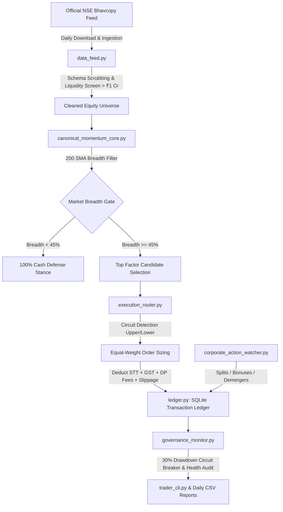

# NSE Portfolio Data Engine & Autonomous Execution Ledger

[](https://www.python.org/downloads/)
[](https://www.sqlite.org/)
[](https://pola.rs/)
[]()
[](LICENSE)

An institutional-grade, automated financial data pipeline, market microstructure simulator, and double-entry portfolio ledger engineered for Indian Equities (NSE). Designed to test systematic factor investing and quantitative portfolio strategies under rigorous real-world friction, statutory tax deductions, and corporate action adjustments.

---

## Architecture & Data Flow



---

## Key Financial & Technical Capabilities

### 1. Automated Capital Market Data Intake
* **Official Exchange Feed Parsing**: Downloads daily Bhavcopy archives directly from the National Stock Exchange of India (`sec_bhavdata_full_*.csv`).
* **Data Scrubbing & Normalization**: Strips malformed headers, standardizes ISIN identifiers, casts price/volume types, and excludes illiquid series and scrips trading below ₹1 Crore daily volume.

### 2. Double-Entry Accounting & Ledger Architecture
* **ACID-Compliant Relational Store**: Implemented in SQLite (`paper_portfolio.db`) with Write-Ahead Logging (`WAL`) and strict foreign keys.
* **Cash Drag & Yield Accrual**: Models reality by compounding risk-free interest (**6.0% p.a.**) daily on unallocated cash reserves across 250 trading sessions.
* **Mark-to-Market (MTM) Tracking**: Maintains dual tracking of gross equity and net production equity, recording daily closing snapshots.

### 3. Indian Market Microstructure & Statutory Friction Modeling
* **Statutory Cost Deductions**: Automatically models Indian capital market transaction friction:
  * **Securities Transaction Tax (STT)**: 0.10% delivery STT.
  * **Exchange & SEBI Turnover Charges**: Modeled at regulatory percentages.
  * **Goods & Services Tax (GST)**: 18.0% levied on transaction and brokerage charges.
  * **Depository Participant (DP) Exit Charges**: Exact ₹15.93 CDSL/NSDL charge deducted per closed position lot.
  * **Execution Slippage**: 20 bps baseline slippage penalty.
* **Circuit Freeze Handling**:
  * **Upper Circuit Freeze**: Identifies locked limit orders on entry and automatically falls back to secondary ranking candidates.
  * **Lower Circuit Freeze**: Marks locked exit orders as `PENDING_EXIT` for next-day liquidation without artificially closing the trade.

### 4. Corporate Action Adjustments
* **Reference & Heuristic Detection**: Mathematical ratio evaluation resolves 2:1, 3:1, 5:1, and 10:1 stock splits and bonus issues.
* **Cost Basis Invariant**: In-place position adjustments adjust share quantities and entry prices proportionally, eliminating phantom P&L spikes.
* **Demerger Neutrality**: Known corporate demergers (e.g., Strides Pharma / Indiabulls) are resolved with factor neutrality ($K=1.0$), ensuring corporate restructuring drops are not falsely magnified.

### 5. Systematic Governance & Macro Regime Controls
* **200 SMA Market Breadth Filter**: Monitors the percentage of liquid NSE equities trading above their 200-day Simple Moving Average. If breadth drops below 45%, the system rotates to a 100% cash defense stance.
* **Drawdown Circuit Breaker**: Hard 30% max peak-to-trough drawdown stop triggers an automatic portfolio lock.

---

## Project Structure

```text
├── data_feed.py                    # Daily Bhavcopy downloader & ingestion pipeline
├── ledger.py                       # SQLite relational double-entry ledger & MTM engine
├── execution_router.py             # Market microstructure & statutory fee accounting
├── corporate_action_watcher.py     # Split, bonus, and demerger adjustment watcher
├── governance_monitor.py           # Drawdown circuit breaker & portfolio health audits
├── canonical_momentum_core.py      # Factor calculation & 200 SMA market breadth gate
├── trading_calendar.py             # Indian market exchange holidays & calendar logic
├── trader_cli.py                   # Command-line interface for status and execution
├── config.py                       # Configuration parameters and environment settings
├── reference_corporate_actions.csv # Seed corporate action reference records
├── reference_nse_holidays.csv      # National Stock Exchange official holiday schedule
├── reports/                        # Audit logs, trade histories, and portfolio statements
│   ├── sample_portfolio_summary.csv
│   ├── sample_trade_history.csv
│   └── sample_corporate_actions.csv
└── tests/                          # Automated unit test suite
    ├── test_corporate_actions.py
    ├── test_ledger_accounting.py
    └── test_market_microstructure.py
```

---

## Quick Start & Usage

### 1. Installation
Clone the repository and install dependencies:
```bash
git clone https://github.com/Hastagtamilnadu/nse-portfolio-data-engine.git
cd nse-portfolio-data-engine
pip install -r requirements.txt
```

### 2. Check Portfolio & Ledger Status
Audit active holdings, cash balances, and governance indicators:
```bash
python trader_cli.py status
```

### 3. Run Daily Ingestion & Mark-to-Market
Execute the end-of-day batch pipeline:
```bash
python trader_cli.py run
```

### 4. Run Test Suite
Run the automated test suite verifying accounting and corporate action math:
```bash
python -m unittest discover tests
```

---

## Author & Contact

**P Ragul**  
* Master of Commerce (M.Com - Accounting & Finance), SRM University  
* Bachelor of Commerce (B.Com - Bank Management), Ramakrishna Mission Vivekananda College  
* Location: Chennai, Tamil Nadu, India  
* LinkedIn: [linkedin.com/in/ragul-accfin](https://www.linkedin.com/in/ragul-accfin)
