# NSE Portfolio Data Engine & Autonomous Execution Ledger

[](https://www.python.org/downloads/)
[](https://www.sqlite.org/)
[](https://pola.rs/)
[]()
[](LICENSE)

An institutional-grade, automated financial data pipeline, market microstructure simulator, and double-entry portfolio ledger engineered for Indian Equities (NSE). Designed to test systematic factor investing strategies under real-world friction: statutory tax deductions, circuit breaker handling, corporate action adjustments, and drawdown circuit breakers.

---

## Architecture & Pipeline Flow

```mermaid
flowchart LR
    subgraph INTAKE ["Stage 1 — Market Data Intake"]
        direction TB
        NSE["Official NSE Bhavcopy Feed\n(sec_bhavdata_full_*.csv)"]
        CAL["Exchange Calendar Validator\n(Trading holidays & weekend filters)"]
        SCRUB["Data Scrubbing & Schema Normalization\n(ISIN resolution, series filtering, type casting)"]
        LIQ["Liquidity Filter\nDaily Traded Value >= Rs. 1.00 Crore"]
        CACHE[("Partitioned Bhavcopy Cache\n(SHA-256 Verified Disk Store)")]

        NSE & CAL --> SCRUB --> LIQ --> CACHE
    end

    subgraph REGIME ["Stage 2 — Factor & Macro Regime Modeling"]
        direction TB
        FACTOR["Factor Calculation Engine\n(Momentum scoring, volatility, volume)"]
        BREADTH["200-Day SMA Breadth Monitor\n(% of liquid NSE universe above 200 SMA)"]
        GATE{"Market Breadth Gate\nBreadth >= 45%?"}
        DEFENSE["100% Cash Defense\n(Zero new buys, existing exposure wound down)"]
        UNIVERSE["Ranked Eligible Universe\n(Top-ranked candidates for allocation)"]

        FACTOR & BREADTH --> GATE
        GATE -->|Breadth < 45%| DEFENSE
        GATE -->|Breadth >= 45%| UNIVERSE
    end

    subgraph MICRO ["Stage 3 — Microstructure & Friction Routing"]
        direction TB
        SIZING["Equal-Weight Capital Allocator\n(Position sizing and cash limits)"]
        CIRCUIT{"Exchange Circuit Check"}
        SKIP["Rejection & Reroute\n(Skip locked asset, select next rank)"]
        DEFER["Order Deferral\n(Flag as PENDING_EXIT for next session)"]
        TAXES["Statutory Friction Engine\nSTT 0.10% + GST 18% + SEBI + DP Rs.15.93 + 20bps slippage"]

        SIZING --> CIRCUIT
        CIRCUIT -->|Upper Circuit| SKIP
        CIRCUIT -->|Lower Circuit| DEFER
        CIRCUIT -->|Normal| TAXES
    end

    subgraph CA_ENGINE ["Stage 4 — Corporate Action Engine"]
        direction TB
        REF_CA["Reference Action Master\n(Verified splits, bonuses, demergers)"]
        HEUR_CA["Heuristic Anomaly Detector\n(Price ratio matching: 2:1, 3:1, 5:1, 10:1)"]
        ADJUSTER["Position & Cost Basis Adjuster\nShares x K | Cost Basis / K"]
        DEMERGER["Demerger Neutrality Resolver\n(K=1.0, prevents phantom P&L drop)"]

        REF_CA & HEUR_CA --> ADJUSTER --> DEMERGER
    end

    subgraph LEDGER_LAYER ["Stage 5 — Ledger & Governance Audit"]
        direction TB
        ACID[("SQLite Double-Entry Ledger\n(WAL Mode, Strict Foreign Key Invariants)")]
        YIELD["Cash Yield Accrual\n(6.0% p.a. compounded daily, 250 sessions)"]
        MTM["Mark-to-Market Valuation\n(Gross equity vs. net production equity)"]
        GOV{"Governance Monitor"}
        KILL["Portfolio Circuit Breaker\n(Emergency lock, >= 30% drawdown)"]
        REPORT["Daily Audit Reports\n(trader_cli.py status | reports/*.csv)"]

        ACID --> YIELD --> MTM --> GOV
        GOV -->|DD >= 30%| KILL
        GOV -->|Normal| REPORT
    end

    CACHE --> FACTOR
    CACHE --> BREADTH
    UNIVERSE --> SIZING
    TAXES --> ACID
    DEMERGER --> ACID

    style INTAKE        fill:#f0f4ff,stroke:#3b82f6,stroke-width:2px
    style REGIME        fill:#f5f0ff,stroke:#8b5cf6,stroke-width:2px
    style MICRO         fill:#fffbf0,stroke:#f59e0b,stroke-width:2px
    style CA_ENGINE     fill:#f0fff4,stroke:#10b981,stroke-width:2px
    style LEDGER_LAYER  fill:#f0fbff,stroke:#06b6d4,stroke-width:2px
```



---

## Repository Structure

```
nse-portfolio-data-engine/
|
+-- config.py                           Global Engine Configuration
|                                       Initial capital, position sizing, cash yield rate (6.0% p.a.),
|                                       slippage penalties, fee rates, breadth threshold (45%)
|
+-- data_feed.py                        Autonomous Market Data Pipeline & Bhavcopy Ingestor
|                                       HTTP download of official NSE Bhavcopy archives, column
|                                       normalization, ISIN verification, Rs. 1 Cr liquidity screen
|
+-- canonical_momentum_core.py          Quantitative Factor Calculations & Macro Regime Gate
|                                       200-day SMA breadth calculations across liquid NSE universe,
|                                       binary risk-on/off switch when breadth drops below 45%,
|                                       cross-sectional momentum ranking and candidate selection
|
+-- execution_router.py                 Indian Market Microstructure & Statutory Friction Simulator
|                                       Upper Circuit detection: skips frozen assets, selects next rank
|                                       Lower Circuit detection: marks exits as PENDING_EXIT
|                                       Statutory deduction math: STT 0.10%, GST 18%, SEBI, DP fees
|
+-- corporate_action_watcher.py         Deterministic Corporate Action Normalization Engine
|                                       Reference action matching and heuristic price-ratio detection
|                                       for splits (2:1, 3:1, 5:1, 10:1) and bonus issues
|                                       Cost basis invariant preservation, demerger factor neutrality
|
+-- ledger.py                           Double-Entry Relational Accounting & Portfolio Store
|                                       SQLite relational database in WAL mode with strict foreign keys
|                                       Daily risk-free interest accrual (6.0% p.a.) on unallocated cash
|                                       Real-time Mark-to-Market calculation of gross and net equity
|
+-- governance_monitor.py               Institutional Risk Controls & Operational Health Audits
|                                       Peak-to-trough drawdown circuit breaker (hard 30% halt)
|                                       Cash balance non-negativity and duplicate execution audits
|                                       Structured diagnostic health logging and incident flagging
|
+-- trading_calendar.py                 Indian Capital Market Calendar & Trading Session Engine
|                                       Official NSE holiday calendar parsing and weekend exclusions
|                                       Trading session validation and next business day lookup
|
+-- trader_cli.py                       Unified Command-Line Interface
|                                       Commands: status, run, reconcile, report
|                                       Formatted tabular console reporting for portfolio state and health
|
+-- reference_corporate_actions.csv     Seed Master for Verified Corporate Action Events
|                                       Historical splits, bonuses, and demergers with exact factors
|
+-- reference_nse_holidays.csv          NSE Official Trading Holiday Schedule
|                                       Session exclusions for Diwali, Republic Day, Independence Day
|
+-- reports/                            Standardized Portfolio Statements & Audit Trail Exports
|   +-- sample_portfolio_summary.csv    Equity snapshots, cash balances, deployed capital, daily MTM
|   +-- sample_trade_history.csv        Transaction logs with STT, GST, slippage breakdown per trade
|   +-- sample_corporate_actions.csv    Applied split, bonus, and demerger adjustments with timestamps
|
+-- tests/                              Automated Unit Test Suite (8 Passing)
|   +-- test_ledger_accounting.py       Verifies double-entry balance, cash yield, and order cost math
|   +-- test_corporate_actions.py       Verifies 2:1/5:1/10:1 split math and cost-basis invariants
|   +-- test_market_microstructure.py   Verifies circuit handling and statutory friction formulas
|
+-- requirements.txt                    Production Python Dependencies
+-- LICENSE                             MIT Open Source License
+-- README.md                           This file
```

---

## Key Financial & Technical Capabilities

### 1. Automated Capital Market Data Intake
- Downloads daily Bhavcopy archives directly from the National Stock Exchange of India (`sec_bhavdata_full_*.csv`).
- Strips malformed headers, standardizes ISIN identifiers, casts price/volume types, and excludes illiquid series below Rs. 1 Crore daily traded value.

### 2. Double-Entry Accounting & Ledger Architecture
- **ACID-Compliant Relational Store**: SQLite with Write-Ahead Logging (WAL) and strict foreign keys.
- **Cash Drag & Yield Accrual**: Computes risk-free interest at **6.0% p.a.** daily on unallocated cash across 250 trading sessions.
- **Mark-to-Market Tracking**: Dual tracking of gross equity and net production equity with daily closing snapshots.

### 3. Indian Market Microstructure & Statutory Friction
Automatically models Indian capital market transaction costs:

| Cost Component | Rate |
|---------------|------|
| Securities Transaction Tax (STT) | 0.10% on delivery value |
| Exchange & SEBI Turnover Charges | Regulatory schedule |
| Goods & Services Tax (GST) | 18.0% on statutory charges |
| DP Charges (CDSL/NSDL) | Rs. 15.93 per closed position lot |
| Execution Slippage | 20 bps baseline |

- **Upper Circuit Freeze**: Identifies locked limit orders on entry, falls back to next-ranked candidate.
- **Lower Circuit Freeze**: Marks locked exit orders as `PENDING_EXIT` for next-day liquidation.

### 4. Corporate Action Adjustments
- **Reference & Heuristic Detection**: Mathematical ratio evaluation resolves 2:1, 3:1, 5:1, and 10:1 stock splits and bonus issues.
- **Cost Basis Invariant**: Adjusts share quantities and entry prices proportionally — eliminates phantom P&L spikes.
- **Demerger Neutrality**: Known demergers resolved with K=1.0 factor, preventing false drawdown amplification.

### 5. Systematic Governance & Macro Regime Controls
- **200 SMA Market Breadth Filter**: Switches to 100% cash defense when the percentage of liquid NSE equities above their 200-day SMA drops below 45%.
- **Drawdown Circuit Breaker**: Hard 30% peak-to-trough drawdown stop triggers an automatic portfolio lock.

---

## Quick Start

### 1. Installation
```bash
git clone https://github.com/Hastagtamilnadu/nse-portfolio-data-engine.git
cd nse-portfolio-data-engine
pip install -r requirements.txt
```

### 2. Check Portfolio & Ledger Status
```bash
python trader_cli.py status
```

### 3. Run Daily Ingestion & Mark-to-Market
```bash
python trader_cli.py run
```

### 4. Run Test Suite
```bash
python -m unittest discover tests
```

---

## Author

**P Ragul**
- Master of Commerce (M.Com — Accounting & Finance), SRM University
- Bachelor of Commerce (B.Com — Bank Management), Ramakrishna Mission Vivekananda College
- Chennai, Tamil Nadu, India
- LinkedIn: [linkedin.com/in/ragul-accfin](https://www.linkedin.com/in/ragul-accfin)
- GitHub: [github.com/Hastagtamilnadu](https://github.com/Hastagtamilnadu)
