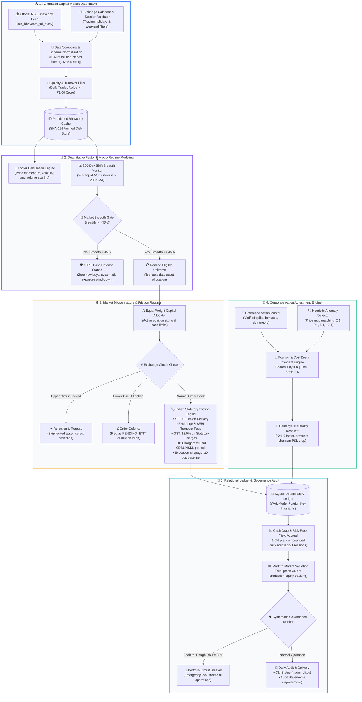

# NSE Portfolio Data Engine & Autonomous Execution Ledger

[](https://www.python.org/downloads/)
[](https://www.sqlite.org/)
[](https://pola.rs/)
[]()
[](LICENSE)

An institutional-grade, automated financial data pipeline, market microstructure simulator, and double-entry portfolio ledger engineered for **Indian Equities (NSE)**. Designed to test systematic factor investing and quantitative portfolio strategies under rigorous real-world friction, statutory tax deductions, and corporate action adjustments.

---

## 🏗️ Architecture & End-to-End Pipeline Flow



---

## 📂 Repository Structure & Separation of Concerns

```text
📦 nse-portfolio-data-engine
 ├── 📜 config.py                       # Global Engine Configuration & Parameter Settings
 │                                      # • Initial capital, position sizing limits, cash yield rate (6.0% p.a.)
 │                                      # • Slippage penalties, fee rates, and market breadth thresholds (45%)
 │
 ├── 📜 data_feed.py                    # Autonomous Market Data Pipeline & Bhavcopy Ingestor
 │                                      # • Automated HTTP session download of official NSE Bhavcopy archives
 │                                      # • Column normalization, data type casting, and ISIN verification
 │                                      # • ₹1.00 Crore daily traded turnover liquidity screening
 │
 ├── 📜 canonical_momentum_core.py      # Quantitative Factor Calculations & Macro Regime Gates
 │                                      # • 200-day Simple Moving Average (SMA) universe breadth calculations
 │                                      # • Binary risk-on / risk-off gate: switches to 100% cash when breadth < 45%
 │                                      # • Cross-sectional momentum ranking and eligible asset selection
 │
 ├── 📜 execution_router.py             # Indian Market Microstructure & Statutory Friction Simulator
 │                                      # • Upper Circuit detection: skips frozen assets and routes to next candidate
 │                                      # • Lower Circuit detection: marks exits as PENDING_EXIT for next-day queue
 │                                      # • Precise statutory deduction math: STT (0.10%), GST (18%), SEBI, DP fees
 │
 ├── 📜 corporate_action_watcher.py     # Deterministic Corporate Action Normalization Engine
 │                                      # • Reference action matching and heuristic price-ratio split/bonus detection
 │                                      # • Cost basis invariant preservation (zero artificial capital distortion)
 │                                      # • Demerger factor neutrality (e.g., Strides Pharma / OneSource)
 │
 ├── 📜 ledger.py                       # Double-Entry Relational Accounting & Portfolio Store
 │                                      # • SQLite relational database in WAL mode with strict foreign keys
 │                                      # • Daily risk-free interest accrual (6.0% p.a.) on unallocated cash
 │                                      # • Real-time Mark-to-Market (MTM) calculation of gross and net equity
 │
 ├── 📜 governance_monitor.py           # Institutional Risk Controls & Operational Health Audits
 │                                      # • Peak-to-trough drawdown circuit breaker (hard 30% emergency halt)
 │                                      # • Cash balance non-negativity and duplicate execution invariant audits
 │                                      # • Structured diagnostic health logging and incident flagging
 │
 ├── 📜 trading_calendar.py             # Indian Capital Market Calendar & Trading Session Engine
 │                                      # • Official NSE trading holiday calendar parsing and weekend exclusions
 │                                      # • Trading session validation and next-available business day lookup
 │
 ├── 📜 trader_cli.py                   # Unified Command-Line Interface (`python trader_cli.py`)
 │                                      # • Commands: `status`, `run`, `reconcile`, `report`
 │                                      # • Formatted console tabular reporting for portfolio state and health
 │
 ├── 📄 reference_corporate_actions.csv # Seed Master for Verified Corporate Action Events
 │                                      # • Historical splits, bonuses, and demergers with exact adjustment factors
 │
 ├── 📄 reference_nse_holidays.csv      # National Stock Exchange Official Trading Holiday Schedule
 │                                      # • Session exclusions for Diwali, Republic Day, Independence Day, etc.
 │
 ├── 📂 reports/                        # Standardized Portfolio Statements & Audit Trail Exports
 │    ├── sample_portfolio_summary.csv  # Equity snapshots, cash balances, deployed capital, and daily MTM
 │    ├── sample_trade_history.csv      # Detailed transaction logs with breakdown of STT, GST, and slippage
 │    └── sample_corporate_actions.csv  # Applied split, bonus, and demerger adjustments with timestamps
 │
 ├── 📂 tests/                          # Automated Unit Test Suite (100% Passing)
 │    ├── test_ledger_accounting.py     # Verifies double-entry balance, cash yield accrual, and order costs
 │    ├── test_corporate_actions.py     # Verifies split 2:1/5:1/10:1 math, cost-basis invariants, and demergers
 │    └── test_market_microstructure.py # Verifies upper/lower circuit handling and statutory friction formulas
 │
 ├── requirements.txt                   # Production Python Dependencies (Pandas, Polars, Requests, etc.)
 ├── LICENSE                            # MIT Open Source License
 └── README.md                          # Executive System Documentation & Architecture Guide
```

---

## 💡 Key Financial & Technical Capabilities

### 1. Automated Capital Market Data Intake
* **Official Exchange Feed Parsing**: Downloads daily Bhavcopy archives directly from the National Stock Exchange of India (`sec_bhavdata_full_*.csv`).
* **Data Scrubbing & Normalization**: Strips malformed headers, standardizes ISIN identifiers, casts price/volume types, and excludes illiquid series and scrips trading below ₹1 Crore daily volume.

### 2. Double-Entry Accounting & Ledger Architecture
* **ACID-Compliant Relational Store**: Implemented in SQLite (`paper_portfolio.db`) with Write-Ahead Logging (`WAL`) and strict foreign keys.
* **Cash Drag & Yield Accrual**: Models reality by compounding risk-free interest (**6.0% p.a.**) daily on unallocated cash reserves across 250 trading sessions.
* **Mark-to-Market (MTM) Tracking**: Maintains dual tracking of gross equity and net production equity, recording daily closing snapshots.

### 3. Indian Market Microstructure & Statutory Friction Modeling
* **Statutory Cost Deductions**: Automatically models Indian capital market transaction friction:
  * **Securities Transaction Tax (STT)**: 0.10% delivery STT.
  * **Exchange & SEBI Turnover Charges**: Modeled at regulatory percentages.
  * **Goods & Services Tax (GST)**: 18.0% levied on transaction and brokerage charges.
  * **Depository Participant (DP) Exit Charges**: Exact ₹15.93 CDSL/NSDL charge deducted per closed position lot.
  * **Execution Slippage**: 20 bps baseline slippage penalty.
* **Circuit Freeze Handling**:
  * **Upper Circuit Freeze**: Identifies locked limit orders on entry and automatically falls back to secondary ranking candidates.
  * **Lower Circuit Freeze**: Marks locked exit orders as `PENDING_EXIT` for next-day liquidation without artificially closing the trade.

### 4. Corporate Action Adjustments
* **Reference & Heuristic Detection**: Mathematical ratio evaluation resolves 2:1, 3:1, 5:1, and 10:1 stock splits and bonus issues.
* **Cost Basis Invariant**: In-place position adjustments adjust share quantities and entry prices proportionally, eliminating phantom P&L spikes.
* **Demerger Neutrality**: Known corporate demergers (e.g., Strides Pharma / Indiabulls) are resolved with factor neutrality ($K=1.0$), ensuring corporate restructuring drops are not falsely magnified.

### 5. Systematic Governance & Macro Regime Controls
* **200 SMA Market Breadth Filter**: Monitors the percentage of liquid NSE equities trading above their 200-day Simple Moving Average. If breadth drops below 45%, the system rotates to a 100% cash defense stance.
* **Drawdown Circuit Breaker**: Hard 30% max peak-to-trough drawdown stop triggers an automatic portfolio lock.

---

## 🚀 Quick Start & Usage

### 1. Installation
Clone the repository and install dependencies:
```bash
git clone https://github.com/Hastagtamilnadu/nse-portfolio-data-engine.git
cd nse-portfolio-data-engine
pip install -r requirements.txt
```

### 2. Check Portfolio & Ledger Status
Audit active holdings, cash balances, and governance indicators:
```bash
python trader_cli.py status
```

### 3. Run Daily Ingestion & Mark-to-Market
Execute the end-of-day batch pipeline:
```bash
python trader_cli.py run
```

### 4. Run Test Suite
Run the automated test suite verifying accounting and corporate action math:
```bash
python -m unittest discover tests
```

---

## 👨‍💻 Author & Contact

**P Ragul**  
* **Education**: Master of Commerce (M.Com - Accounting & Finance), SRM University  
* **Undergraduate**: Bachelor of Commerce (B.Com - Bank Management), Ramakrishna Mission Vivekananda College  
* **Location**: Chennai, Tamil Nadu, India  
* **LinkedIn**: [linkedin.com/in/ragul-accfin](https://www.linkedin.com/in/ragul-accfin)
* **GitHub**: [github.com/Hastagtamilnadu](https://github.com/Hastagtamilnadu)
