# NSE Portfolio Ledger & Market Microstructure Engine

[](https://www.python.org/downloads/)
[](https://www.sqlite.org/)
[](https://pola.rs/)
[]()
[](LICENSE)

An automated end-of-day financial data pipeline, Indian transaction cost accounting ledger, and corporate action adjustment engine built for **National Stock Exchange (NSE) equities**.

The project models how equity portfolios behave under real-world Indian market accounting rules: deducting statutory transaction taxes (STT, GST, SEBI, and CDSL/NSDL Depository Participant charges), adjusting cost basis across stock splits, bonuses, and demergers, accruing daily yield on idle cash reserves, and handling exchange circuit freezes.

---

## Project Scope & Development Methodology

This project was built from an **Accounting & Financial Data Analysis** perspective, combining Indian capital market accounting rules with AI-assisted Python automation:

* **Financial & Accounting Logic (Author-Designed):**
  * **Statutory Transaction Cost Accounting:** Specified the exact Indian delivery equity fee deductions — Securities Transaction Tax (`0.10%`), GST (`18%` on brokerage/exchange fees), SEBI/exchange turnover charges, Depository Participant exit charges (`Rs. 15.93` per closed script), and `20 bps` execution slippage.
  * **Corporate Action Cost-Basis Math:** Designed the adjustment rules for stock splits (`2:1`, `5:1`, `10:1`), bonus issues, and corporate demergers (`K = 1.0` neutrality factor) so historical share quantities and entry prices preserve total invested capital without creating artificial P&L spikes.
  * **Portfolio Ledger & Cash Yield Rules:** Defined the double-entry cash and position tracking rules, including daily interest accrual (`6.0% p.a.` across 250 trading days) on uninvested cash and `200-day SMA` market breadth defense (`< 45%` breadth rotates to cash).
* **Software Implementation (AI-Assisted):**
  * Used AI coding assistants to structure the Python modules, SQLite database queries, command-line reporting interface (`trader_cli.py`), and unit test suite.

---

## Architecture & Pipeline Flow

```mermaid
flowchart LR
    NSE["Official NSE Bhavcopy Feed\nsec_bhavdata_full_*.csv"]
    CAL["Exchange Calendar Validator\nTrading holidays & weekend filters"]
    SCRUB["Data Scrubbing & Normalization\nISIN resolution, series filtering, type casting"]
    LIQ["Liquidity Filter\nDaily Traded Value >= Rs. 1.00 Crore"]
    CACHE[("Partitioned Bhavcopy Cache\nLocal CSV/Parquet Store")]

    FACTOR["Factor Calculation Engine\nMomentum scoring, volatility, volume"]
    BREADTH["200-Day SMA Breadth Monitor\n% of liquid NSE universe above 200 SMA"]
    GATE{"Market Breadth Gate\nBreadth >= 45%?"}
    DEFENSE["100% Cash Defense\nZero new buys, existing exposure wound down"]
    UNIVERSE["Ranked Eligible Universe\nTop-ranked candidates for allocation"]

    SIZING["Equal-Weight Capital Allocator\nPosition sizing and cash limits"]
    CIRCUIT{"Exchange Circuit Check"}
    SKIP["Rejection & Reroute\nSkip locked asset, select next rank"]
    DEFER["Order Deferral\nFlag as PENDING_EXIT for next session"]
    TAXES["Statutory Friction Engine\nSTT 0.10% + GST 18% + SEBI + DP Rs.15.93 + 20bps slippage"]

    REF_CA["Reference Action Master\nVerified splits, bonuses, demergers"]
    HEUR_CA["Heuristic Ratio Detector\nPrice ratio matching: 2:1, 3:1, 5:1, 10:1"]
    ADJUSTER["Position & Cost Basis Adjuster\nShares x K | Cost Basis / K"]

    ACID[("SQLite Portfolio Ledger\nCash, Positions, Trades & Daily Equity")]
    YIELD["Cash Yield Accrual\n6.0% p.a. compounded daily, 250 sessions"]
    MTM["Mark-to-Market Valuation\nGross equity vs. net post-tax equity"]
    GOV{"Drawdown & Risk Check"}
    KILL["Portfolio Circuit Breaker\nEmergency lock if drawdown >= 30%"]
    REPORT["Daily Audit Reports\ntrader_cli.py status | reports/*.csv"]

    NSE & CAL --> SCRUB --> LIQ --> CACHE
    CACHE --> FACTOR
    CACHE --> BREADTH
    FACTOR & BREADTH --> GATE
    GATE -->|"Breadth < 45%"| DEFENSE
    GATE -->|"Breadth >= 45%"| UNIVERSE
    UNIVERSE --> SIZING --> CIRCUIT
    CIRCUIT -->|"Upper Circuit"| SKIP
    CIRCUIT -->|"Lower Circuit"| DEFER
    CIRCUIT -->|"Normal"| TAXES
    REF_CA & HEUR_CA --> ADJUSTER
    TAXES & ADJUSTER --> ACID
    ACID --> YIELD --> MTM --> GOV
    GOV -->|"DD >= 30%"| KILL
    GOV -->|"Normal"| REPORT

    subgraph INTAKE ["1. Market Data Intake"]
        NSE
        CAL
        SCRUB
        LIQ
        CACHE
    end

    subgraph REGIME ["2. Factor & Market Breadth Check"]
        FACTOR
        BREADTH
        GATE
        DEFENSE
        UNIVERSE
    end

    subgraph MICRO ["3. Order Sizing & Statutory Taxes"]
        SIZING
        CIRCUIT
        SKIP
        DEFER
        TAXES
    end

    subgraph CA_ENGINE ["4. Corporate Action Adjustments"]
        REF_CA
        HEUR_CA
        ADJUSTER
    end

    subgraph LEDGER_LAYER ["5. SQLite Ledger & Daily Statements"]
        ACID
        YIELD
        MTM
        GOV
        KILL
        REPORT
    end

    style INTAKE       fill:none,stroke:#3b82f6,stroke-width:2px
    style REGIME       fill:none,stroke:#8b5cf6,stroke-width:2px
    style MICRO        fill:none,stroke:#f59e0b,stroke-width:2px
    style CA_ENGINE    fill:none,stroke:#10b981,stroke-width:2px
    style LEDGER_LAYER fill:none,stroke:#06b6d4,stroke-width:2px
```



---

## Repository Structure

```
nse-portfolio-data-engine/
|
+-- config.py                           Global Engine Configuration
|                                       Initial capital, position sizing, cash yield rate (6.0% p.a.),
|                                       slippage penalties, fee rates, breadth threshold (45%)
|
+-- data_feed.py                        NSE Bhavcopy Downloader & Data Cleaner
|                                       HTTP download of official NSE Bhavcopy archives, column
|                                       normalization, ISIN verification, Rs. 1 Cr liquidity screen
|
+-- canonical_momentum_core.py          Factor Calculations & Market Breadth Filter
|                                       200-day SMA breadth calculations across liquid NSE universe,
|                                       binary risk-on/off switch when breadth drops below 45%,
|                                       cross-sectional momentum ranking and candidate selection
|
+-- execution_router.py                 Indian Statutory Tax & Circuit Simulator
|                                       Upper Circuit detection: skips frozen assets, selects next rank
|                                       Lower Circuit detection: marks exits as PENDING_EXIT
|                                       Statutory deduction math: STT 0.10%, GST 18%, SEBI, DP fees
|
+-- corporate_action_watcher.py         Corporate Action Adjustment Module
|                                       Reference action matching and price-ratio detection
|                                       for splits (2:1, 3:1, 5:1, 10:1) and bonus issues
|                                       Cost basis invariant preservation, demerger factor neutrality
|
+-- ledger.py                           SQLite Portfolio Accounting & MTM Engine
|                                       SQLite database tracking cash, open positions, and trade logs
|                                       Daily risk-free interest accrual (6.0% p.a.) on unallocated cash
|                                       Daily Mark-to-Market calculation of gross and net equity
|
+-- governance_monitor.py               Drawdown & Ledger Reconciliation Checks
|                                       Peak-to-trough drawdown circuit breaker (30% stop)
|                                       Cash balance non-negativity and duplicate trade checks
|
+-- trading_calendar.py                 NSE Holiday & Session Calendar
|                                       Official NSE holiday calendar parsing and weekend exclusions
|
+-- trader_cli.py                       Command-Line Interface
|                                       Commands: status, run, reconcile, report
|
+-- reference_corporate_actions.csv     Seed Master for Verified Corporate Action Events
+-- reference_nse_holidays.csv          NSE Official Trading Holiday Schedule
|
+-- reports/                            Sample Portfolio Statements & Audit Exports
|   +-- sample_portfolio_summary.csv    Equity snapshots, cash balances, deployed capital, daily MTM
|   +-- sample_trade_history.csv        Transaction logs with STT, GST, slippage breakdown per trade
|   +-- sample_corporate_actions.csv    Applied split, bonus, and demerger adjustments with timestamps
|
+-- tests/                              Unit Test Suite (8 Passing)
|   +-- test_ledger_accounting.py       Verifies double-entry balance, cash yield, and order cost math
|   +-- test_corporate_actions.py       Verifies 2:1/5:1/10:1 split math and cost-basis invariants
|   +-- test_market_microstructure.py   Verifies circuit handling and statutory friction formulas
|
+-- requirements.txt                    Python Dependencies
+-- LICENSE                             MIT License
+-- README.md                           Project documentation
```

---

## Key Financial & Accounting Capabilities

### 1. Official Exchange Feed Ingestion
- Downloads daily Bhavcopy archives directly from the National Stock Exchange of India (`sec_bhavdata_full_*.csv`).
- Standardizes ISIN identifiers, filters for active equity series (`EQ`), and screens out illiquid stocks trading below **Rs. 1 Crore** in daily turnover.

### 2. Portfolio Accounting & Cash Yield Accrual
- **SQLite Accounting Ledger**: Tracks cash balances, open share lots, realized P&L, and itemized tax/fee deductions in SQLite (`paper_portfolio.db`).
- **Cash Drag & Yield Accrual**: Accrues risk-free interest at **6.0% p.a.** daily (`0.06 / 250` per trading day) on uninvested cash balances.
- **Mark-to-Market Valuation**: Records daily snapshots of both gross portfolio value and net post-tax liquidation value.

### 3. Indian Statutory Transaction Cost Modeling

| Cost Component | Applied Rate | Accounting Treatment |
|---------------|--------------|----------------------|
| Securities Transaction Tax (STT) | 0.10% on delivery value | Deducted on both buy and sell delivery legs |
| Exchange & SEBI Turnover Charges | Regulatory schedule | Applied to gross trade value |
| Goods & Services Tax (GST) | 18.0% | Levied on exchange and brokerage charges |
| Depository Participant (DP) Fee | Rs. 15.93 per exit | Fixed CDSL/NSDL depository debit charge on sell orders |
| Execution Slippage | 20 bps (0.20%) | Applied to entry and exit execution prices |

- **Upper Circuit Freeze**: Skips buy candidates locked at their upper circuit limit and allocates capital to the next eligible stock.
- **Lower Circuit Freeze**: Flags positions locked at their lower circuit limit as `PENDING_EXIT` for execution in the next liquid session.

### 4. Corporate Action Cost-Basis Adjustments
- **Split & Bonus Adjustments**: Resolves `2:1`, `3:1`, `5:1`, and `10:1` stock splits and bonus issues by multiplying held share quantity by $K$ and dividing entry price by $K$, keeping total cost basis constant ($\text{Shares} \times \text{Avg Cost} = \text{Invariant}$).
- **Demerger Neutrality**: Applies a `K = 1.0` hold factor on known corporate demergers (such as Strides Pharma / OneSource) so ex-date price adjustments are not misclassified as stock split ratios.

### 5. Market Regime & Drawdown Controls
- **200-Day SMA Breadth Filter**: Computes the percentage of liquid NSE stocks trading above their 200-day moving average. When market breadth falls below **45%**, new equity purchases are paused and cash is preserved.
- **Drawdown Stop**: Halts new allocations if portfolio peak-to-trough drawdown reaches **30%**.

---

## Quick Start

### 1. Installation
```bash
git clone https://github.com/Hastagtamilnadu/nse-portfolio-data-engine.git
cd nse-portfolio-data-engine
pip install -r requirements.txt
```

### 2. Check Portfolio & Ledger Status
```bash
python trader_cli.py status
```

### 3. Run Daily Ingestion & Mark-to-Market
```bash
python trader_cli.py run
```

### 4. Run Unit Tests
```bash
python -m unittest discover tests
```

---

## Author

**P Ragul**
- Master of Commerce (M.Com — Accounting & Finance), SRM University
- Bachelor of Commerce (B.Com — Bank Management), Ramakrishna Mission Vivekananda College
- LinkedIn: [linkedin.com/in/ragul-accfin](https://www.linkedin.com/in/ragul-accfin)
